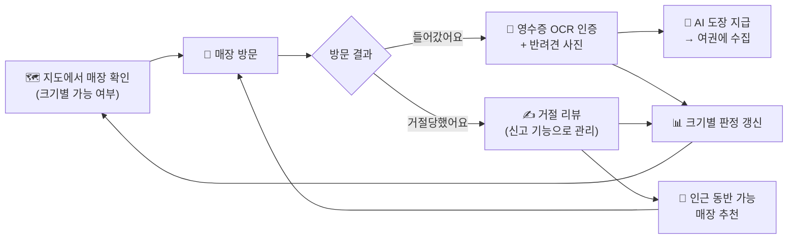
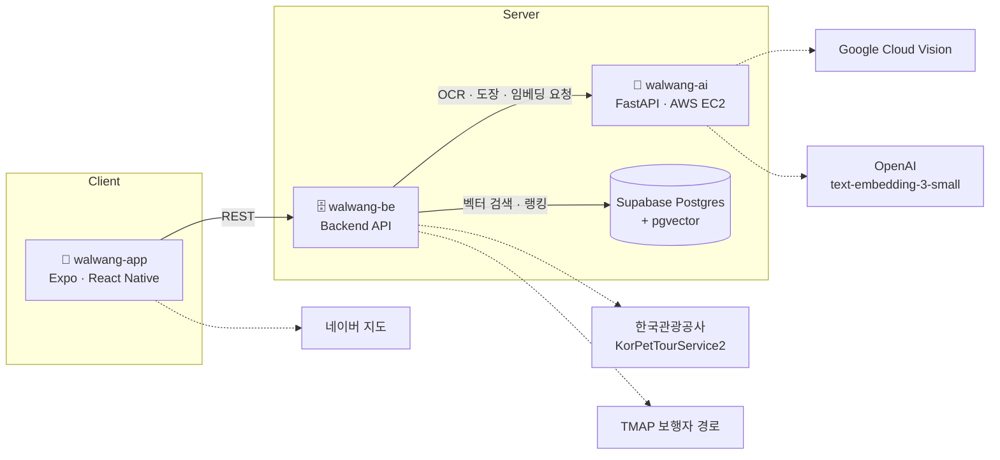

<div align="center">


# TripPaw: 나만의 반려견 산책코스 🦮

**"우리 개, 여기 들어갈 수 있을까?"**
실제 방문자의 인증 리뷰로 쌓아 올린 **견종 크기별** 반려견 동반 정보

<br />


<br />

[📲 원스토어에서 받기](https://m.onestore.co.kr/v2/ko-kr/app/0001008911) · [📦 최신 릴리즈 (v1.2.0 APK)](https://github.com/KTO-TourData-2026/walwang-app/releases/tag/v1.2.0)

<br />


</div>

<br />

## 📖 프로젝트 소개

반려견 동반 가능 여부는 매장마다 기준과 안내 방식이 제각각이고, 이를 미리 확인할 만한 **신뢰할 수 있는 데이터셋이 거의 없습니다.** 한국관광공사 API의 공식 데이터에서도 동반 가능 여부가 명시된 매장은 극히 일부이며, "반려견 동반 가능"이라고 적혀 있어도 **대형견은 거절되는 경우**가 많습니다. 그 결과 반려인은 헛걸음과 현장 갈등을 반복합니다.

**TripPaw**는 한국관광공사 OpenAPI의 공식 관광정보에서 출발해, **영수증과 반려견 사진으로 이중 인증한 실제 방문자 리뷰**를 누적하여 공식 데이터가 채우지 못하는 영역을 사용자가 직접 완성해 나가는 서비스입니다.

| 항목        | 내용                                                              |
| ----------- | ----------------------------------------------------------------- |
| 공모전      | 2026 관광데이터 활용 공모전 · **지정과제 6**                      |
| 팀          | 왈왕 (WalWang)                                                    |
| 서비스      | TripPaw: 나만의 반려견 산책코스 (Android 앱)                      |
| 개발 기간   | 2026.08 ~ 2026.09                                                 |
| 서비스 지역 | 서울 성동구 (MVP)                                                 |
| 타깃        | 반려견 동반 여행·나들이를 계획하지만 사전 확인 수단이 없는 반려인 |

### 🐾 기존 서비스 vs TripPaw

|             | 기존 서비스                       | **TripPaw**                                                     |
| ----------- | --------------------------------- | --------------------------------------------------------------- |
| 데이터 출처 | 매장이 일방적으로 게시하는 안내문 | 공식 데이터 + **실제 방문자 리뷰**가 누적되며 확장되는 데이터셋 |
| 신뢰성      | 검증 없는 후기·광고성 리뷰        | **영수증 OCR(방문) + 반려견 사진(동반)** 이중 인증              |
| 판정 단위   | 동반 가능 / 불가                  | **소·중형견 / 대형견** 크기별 `가능 · 미확인 · 불가`            |
| 최신성      | 한 번 등록된 정보가 그대로 고착   | **시간 가중치**로 최근 리뷰를 더 크게 반영                      |
| 정보의 깊이 | 출입 가능 여부까지                | 리뷰 텍스트 + **약 20종 해시태그** (테라스 한정, 전용 메뉴 등)  |
| 참여 동기   | 리뷰 작성은 의무·귀찮은 일        | 내 반려견 사진이 **AI 도장**이 되어 **여권**에 모이는 수집 경험 |

<br />

## 📌 목차

- [📖 프로젝트 소개](#-프로젝트-소개)
- [✨ 주요 기능](#-주요-기능)
- [🧭 핵심 사용자 흐름](#-핵심-사용자-흐름)
- [🧠 How It Works](#-how-it-works)
- [🌐 활용 공공데이터 · API](#-활용-공공데이터--api)
- [🏗 시스템 아키텍처](#-시스템-아키텍처)
- [🛠 기술 스택](#-기술-스택)
- [📁 프로젝트 구조](#-프로젝트-구조)
- [🚀 발전 계획](#-발전-계획)
- [👥 팀 소개](#-팀-소개)

<br />

## ✨ 주요 기능

### 🗺 `#동반가능매장조회` — 지도 기반 매장 탐색 및 크기별 동반 가능 여부 확인

<div align="center">

|  |     |  |  |
| :-------------------------------------------------------: | :----------------------------------------------------------: | :-------------------------------------------------------: | :-------------------------------------------------------: |
|      지도 기반 매장 조회<br/>(크기 필터 · 매장 검색)      | 매장 상세<br/>(크기별 가능 여부 · 인기 해시태그 · 최근 리뷰) |              리뷰 전체보기<br/>(들어갔어요)               |             리뷰 전체보기<br/>(거절당했어요)              |

</div>

- 반려견 동반 가능 매장을 **지도에서 한눈에 조회·검색**합니다.
- **소·중형견 / 대형견 필터**로 내 반려견이 입장 가능한 매장을 즉시 확인합니다.
- 매장 상세에서 크기별 `가능 / 미확인 / 불가` 상태, 인기 해시태그, 최근 리뷰를 확인합니다.
- 각 상태는 인증 리뷰의 누적 비율과 시간 가중치로 **자동 산정**됩니다. → [판정 로직](#1-크기별-동반-가능-판정)

### 🧾 `#리뷰_들어갔어요` — 영수증 OCR 인증 기반 리뷰 작성

<div align="center">

|  |  |  |  |
| :------------------------------------------------------------------: | :------------------------------------------------------------------: | :------------------------------------------------------------------: | :------------------------------------------------------------------: |
|                    영수증 촬영<br/>OCR 인증 완료                     |                    반려견 사진 촬영<br/>미리보기                     |   '들어갔어요' 리뷰 작성<br/>(사진 · 크기 · 해시태그 · 10자 이상)    |                리뷰 작성 완료<br/>(도장 실시간 지급)                 |

</div>

- 방문 후 **[들어갔어요]** 를 선택하면 영수증을 촬영해 **OCR로 상호명을 대조**, 실제 방문을 인증합니다.
- 반려견 사진, 반려견 크기, 해시태그(약 20종), 최소 10자의 텍스트를 입력합니다.
- 입력한 해시태그와 리뷰 텍스트는 **코스 추천 데이터**로 활용됩니다.
- 리뷰 등록과 동시에 반려견 사진으로 만든 **도장을 실시간으로 지급**합니다.

### 🚫 `#리뷰_거절당했어요` — 거절 매장 인근의 동반 가능 매장 추천

<div align="center">

|  |  |  |  |
| :-------------------------------------------------------------------: | :-------------------------------------------------------------------: | :-------------------------------------------------------------------: | :-------------------------------------------------------------------: |
|            방문 결과 선택<br/>(들어갔어요 / 거절당했어요)             |             '거절당했어요' 리뷰 작성<br/>(허위 리뷰 경고)             |             리뷰 작성 완료<br/>(인근 동반 가능 매장 추천)             |                     리뷰 신고<br/>(허위 · 도배성)                     |

</div>

- **[거절당했어요]** 리뷰는 별도 인증 없이 작성할 수 있습니다.
- 대신 **허위 리뷰 작성 시 계정 정지 가능성**을 명시하고, **리뷰 신고**(허위·도배성) 기능으로 악용을 막습니다.
- 작성을 마치면 해당 매장 **인근의 같은 크기 반려견이 이용 가능한 매장**을 즉시 추천해, 헛걸음을 대체 방문으로 전환합니다.

### 🐶 `#강아지도장` — AI 기반 반려견 사진 인식 도장 생성

<div align="center">

|  |  |  |  |
| :---------------------------------------------------------: | :---------------------------------------------------------: | :---------------------------------------------------------: | :---------------------------------------------------------: |
|            리뷰 작성 완료<br/>(도장 실시간 지급)            |              마이페이지 여권<br/>(도장 · 날짜)              |          도장 상세<br/>(원본 저장 · 리뷰 바로가기)          |                          해당 리뷰                          |

</div>

- 업로드한 반려견 사진에서 **AI가 반려견 영역만 분리**해 세상에 하나뿐인 도장을 만듭니다.
- 마이페이지 **여권** 화면에 날짜와 함께 도장이 수집됩니다.
- 도장을 선택하면 **원본 사진을 저장**하거나 **해당 리뷰로 바로 이동**할 수 있습니다.
- 반려견 인식에 실패하면 발바닥 아이콘 도장을 대신 지급합니다.

### 🧭 `#맞춤코스추천` — 사용자 입력값 기반 맞춤 산책 코스 추천

<div align="center">

|  |  |  |  |
| :----------------------------------------------------------: | :----------------------------------------------------------: | :----------------------------------------------------------: | :----------------------------------------------------------: |
|                    코스 추천 입력값 선택                     |                         출발지 선택                          |      코스 추천 결과<br/>(거리 · 도보 시간 · 인근 명소)       |                        코스 저장 완료                        |

</div>

- **출발지, 반려견 크기, 목적(산책·식사·카페), 소요 시간, 해시태그(최대 5개)** 를 고르면 코스를 추천합니다.
- 선택한 태그와 실제 리뷰의 해시태그·본문을 **임베딩 유사도**로 비교해 매장을 선정합니다.
- 장소 간 **도보 경로·거리·소요 시간**을 지도에 표시합니다.
- 코스 인근의 **반려동물 동반 가능 공원·관광지**(한국관광공사)를 함께 제안합니다.

### 🔖 `#코스장소저장` — 코스/장소 저장

<div align="center">

|  |  |  |  |
| :---------------------------------------------------------: | :---------------------------------------------------------: | :---------------------------------------------------------: | :---------------------------------------------------------: |
|                     장소/코스 저장 완료                     |                  저장 탭<br/>(장소 · 코스)                  |                       코스 이름 수정                        |                       저장 코스 상세                        |

</div>

- 매장 상세와 코스 추천 결과 화면에서 **장소 또는 코스를 저장**합니다.
- 저장 탭에서 **장소별 · 코스별**로 나눠 조회합니다.
- 저장한 코스는 **이름을 수정**하고 **상세 경로를 다시 확인**할 수 있습니다.

<br />

## 🧭 핵심 사용자 흐름

지도에서 매장을 확인하고, 방문한 뒤 리뷰를 남기면, 그 결과가 다시 지도에 반영되고 도장이 쌓이는 **데이터 선순환 구조**입니다.



<br />

## 🧠 How It Works

### 1. 크기별 동반 가능 판정

리뷰는 **소·중형견 / 대형견** 구간별로 따로 집계되며, 각 구간의 상태는 아래 규칙으로 산정됩니다.

| 상태      | 조건                                                   |
| --------- | ------------------------------------------------------ |
| ✅ 가능   | 동반 입장 리뷰 **4건 이상** 이면서 전체의 **70% 이상** |
| ⛔ 불가   | 거절 리뷰 **3건 이상** 이면서 전체의 **55% 이상**      |
| ❔ 미확인 | 위 조건을 모두 충족하지 않는 경우                      |

**시간 가중치 (지수 감쇠)**

- 리뷰 작성일로부터 **90일마다 가중치가 절반**으로 줄어듭니다.
- 리뷰가 적은 매장에서 오래된 리뷰가 지나치게 무력화되지 않도록 **최소 가중치(바닥값)** 를 둡니다.
- 과거에 '가능'이었던 매장도 최근 반대 리뷰가 쌓이면 **빠르게 상태가 바뀌어**, 정보가 고착되지 않습니다.

<!-- (선택) 가중치 수식: w(t) = max(0.5^(t/90), w_min) -->

### 2. 영수증 OCR 방문 인증

```
영수증 촬영 → AI 서버 · Google Cloud Vision OCR → 텍스트에서 상호명 추출 → 매장 상호명과 대조 → 일치 시 리뷰 작성 허용
```

### 3. AI 도장 생성

```
반려견 사진 → YOLOv8n (COCO class 16 · dog, 반려견 영역 탐지) → rembg · U2Net (배경 제거) → 도장 이미지 생성
                     └─ 인식 실패 시 → 🐾 발바닥 기본 도장
```

- 세그멘테이션은 메모리를 많이 쓰는 작업이라, `asyncio.Semaphore` + `asyncio.to_thread`로 요청을 **직렬화**해 메모리 제한 환경(EC2)에서의 OOM을 방지합니다.

### 4. 맞춤 코스 추천

```
[사전] 매장별 해시태그 + 리뷰 텍스트 → AI 서버 · text-embedding-3-small → pgvector에 저장

사용자 입력 (출발지 · 크기 · 목적 · 소요 시간 · 해시태그)
   → AI 서버가 선택 태그를 쿼리 임베딩으로 변환해 반환
   → 후보 매장 필터: 해당 크기 '가능' 판정  또는  한국관광공사 반려동물 동반여행 정보와 매칭
   → 백엔드가 pgvector 코사인 유사도로 매장 검색·랭킹 → 매장 선정
   → TMAP 보행자 경로 API로 장소 간 경로·거리·시간 산출
   → 코스 인근 공원·관광지(KorPetTourService2) 함께 제안
```

> AI 서버는 **임베딩 값만 반환**하고, 벡터 검색과 랭킹은 백엔드가 자체 쿼리로 수행합니다.

<br />

## 🌐 활용 공공데이터 · API

### 한국관광공사 OpenAPI

| API                                                                    | 활용                                                                                     |
| ---------------------------------------------------------------------- | ---------------------------------------------------------------------------------------- |
| **반려동물 동반여행 서비스** (`KorPetTourService2`) · `areaBasedList2` | 반려동물 동반 가능 여행지 실시간 조회 → 매장 매칭, 코스 추천 후보, 인근 공원·관광지 추천 |

- **조회 기준 전환** — 실측 결과 전국 9,685건 중 `areaCode`가 채워진 건은 542건(**6%**)에 불과해 지역 기준 조회가 불가능했습니다. 법정동 코드(`lDongRegnCd` · `lDongSignguCd`)로 전환해 **커버리지 99.9%** 를 확보했습니다. 분류 역시 `cat1~3`이 대부분 공백이어서 `lclsSystm1~3`을 사용했습니다.
- **매장 매칭** — 조회된 장소를 **상호명 유사도 + 좌표 거리** 기준의 단계별 규칙으로 서비스 매장과 매칭합니다. 매칭된 매장은 리뷰가 쌓이기 전 단계에서 동반 가능 여부의 **보조 근거**로 표시되고, 코스 추천 후보에도 포함됩니다.
- **처리 방식** — 응답은 요청 처리 시점에만 사용하며 데이터베이스에 저장하지 않습니다.

### 기타 API · 파일데이터

| 데이터                                           | 활용                                      |
| ------------------------------------------------ | ----------------------------------------- |
| 소상공인시장진흥공단 상가(상권)정보              | 매장 기본정보(상호명·주소·업종·좌표) 구축 |
| Google Cloud Vision API                          | 영수증 텍스트 인식(OCR) 기반 방문 인증    |
| OpenAI Embeddings API (`text-embedding-3-small`) | 태그 기반 코스 추천 유사도 검색           |
| TMAP 보행자 경로 API (SK텔레콤)                  | 추천 코스의 도보 경로·거리·소요 시간 산출 |
| 네이버 지도 API (네이버클라우드)                 | 매장 탐색 지도 및 코스 경로 표시          |

<br />

## 🏗 시스템 아키텍처

<!-- 아키텍처 다이어그램 이미지 -->



| 레포                                                              | 역할                                                                                              |
| ----------------------------------------------------------------- | ------------------------------------------------------------------------------------------------- |
| [`walwang-app`](https://github.com/KTO-TourData-2026/walwang-app) | Android 앱 (지도·리뷰·도장·코스 추천 UI)                                                          |
| `walwang-be` _(private)_                                          | <!-- TODO --> 매장·리뷰·판정·코스 API, 벡터 검색·랭킹, 외부 API 연동                              |
| `walwang-ai` _(private)_                                          | FastAPI 단일 마이크로서비스 — 영수증 OCR, 반려견 탐지·배경 제거(도장 생성), 태그·리뷰 임베딩 생성 |

<br />

## 🛠 기술 스택

### 📱 Frontend

| 분류           | 스택                                                                                                                                                                                                                                                                                                                                                                                                                                                                                           |
| -------------- | ---------------------------------------------------------------------------------------------------------------------------------------------------------------------------------------------------------------------------------------------------------------------------------------------------------------------------------------------------------------------------------------------------------------------------------------------------------------------------------------------- |
| Framework      |                                                                                                                                                                      |
| Language       |                                                                                                                                                                                                                                                                                                                                                                                 |
| Routing        |                                                                                                                                                                                                                                                                                                                                                                                     |
| State · Data   |                                                                                                                                                                     |
| Form           |                                                                                                                                                                                                                                                                          |
| Map            |                                                                                                                                                                                                                                                                                                                                                                                        |
| Build · Deploy |                                                                                                                                                                                                                                                                                                                  |
| Code Quality   |      |

### 🗄 Backend

| 분류             | 스택                                                                                                                                                                                                                                                                                                                                                                                                                                                                                                  | 용도                                          |
| ---------------- | ----------------------------------------------------------------------------------------------------------------------------------------------------------------------------------------------------------------------------------------------------------------------------------------------------------------------------------------------------------------------------------------------------------------------------------------------------------------------------------------------------- | --------------------------------------------- |
| Language · Build |                                                                                                                                                                                                                                                                                              |                                               |
| Framework        |     | REST API · 인증/인가 · 요청 검증              |
| Admin Console    |                                                                                                                                                                                                                                                                                                                                                                                              | 관리자 콘솔 (리뷰 신고 검토 등)               |
| ORM              |                                                                                                                                          | PostGIS 공간 쿼리 (좌표·거리 기반 검색)       |
| Database · Cache |                                                                      |                                               |
| Auth · Security  |                                                                                                                                                                                                                                       | 토큰 인증 · 비밀번호 해시 · 관리자 2단계 인증 |
| Image            |                                                                                                                                                                                                                                                                                                                                                                                                                  | 이미지 리사이징 · 썸네일                      |
| API Docs         |                                                                                                                                                                                                                                                                                                                                                                             | Swagger UI                                    |
| Test             |                                                                                                                                                                                                                                                                                                                                                                                                  |                                               |
| Infra · CI/CD    |                                                                                                                                                                     | 배포 · 리버스 프록시 · 자동 배포              |

### 🤖 AI

| 분류        | 스택                                                                                                                                                                                                                  | 용도                                                 |
| ----------- | --------------------------------------------------------------------------------------------------------------------------------------------------------------------------------------------------------------------- | ---------------------------------------------------- |
| Language    |                                                                                                                    |                                                      |
| Framework   |                                                                                                                 | 단일 마이크로서비스                                  |
| Vision      |                            | 반려견 영역 탐지(COCO class 16) · 배경 제거 → 도장   |
| OCR         |                                                                                     | 방문 인증용 영수증 OCR                               |
| Embedding   |                                                                                          | 매장(태그+리뷰) 임베딩, 검색 시 태그 쿼리 임베딩     |
| Vector DB   |   | 임베딩 저장, 코사인 유사도 벡터 검색                 |
| Infra       |                                                                                                               | 배포                                                 |
| Concurrency | `asyncio.Semaphore` · `asyncio.to_thread`                                                                                                                                                                             | 세그멘테이션 요청 직렬화로 메모리 제한 환경 OOM 방지 |

<br />

## 📁 FE 프로젝트 구조

```
walwang-app/
├── assets/               # 이미지 · 아이콘 · 폰트
├── docs/                 # PRD · 사용자 흐름 · 컨벤션 · 코드 스타일 · CI
├── src/
│   ├── api/              # axios 인스턴스 · 인터셉터 · API 함수
│   ├── app/              # expo-router 라우트 (= 화면)
│   │   ├── (auth)/       # 로그인 · 회원가입
│   │   ├── (main)/       # 하단 탭: 지도 · 저장 · 마이
│   │   ├── store/[placeId]/    # 매장 상세 · 리뷰 전체보기
│   │   ├── review/[placeId]/   # 결과 선택 → 영수증 → 사진 → 작성 → 완료
│   │   ├── recommend/    # 코스 추천 입력 · 결과
│   │   ├── my/           # 여권(도장) · 내 리뷰 · 프로필 수정
│   │   ├── onboarding.tsx
│   │   └── index.tsx     # 진입 게이트 (토큰 확인 후 분기)
│   ├── components/       # 재사용 UI
│   ├── constants/        # 테마 · 팔레트
│   ├── hooks/            # 커스텀 훅
│   ├── stores/           # zustand 스토어
│   ├── types/            # API 응답 타입
│   └── utils/
└── app.config.ts         # 네이티브 설정 단일 소스
```

<br />

## 🚀 발전 계획

| 구분   | 계획                           | 내용                                                                                                                                                                                             |
| ------ | ------------------------------ | ------------------------------------------------------------------------------------------------------------------------------------------------------------------------------------------------ |
| 확장성 | **커버리지 확장**              | 한국관광공사 OpenAPI의 전국 데이터를 그대로 수용하는 구조로, 별도 변경 없이 지역 확장이 가능합니다. 반려견 동반 여행 수요가 높은 강원·제주·부산부터 확장해 여행지 단위 정보 인프라로 성장합니다. |
| 확장성 | **자연어 기반 코스 추천**      | 누적된 해시태그와 리뷰를 LLM으로 파싱해 _"대형견과 갈 수 있는 한적한 야외 카페 코스"_ 같은 자연어 질의에 대응합니다.                                                                             |
| 지속성 | **인증 체계 고도화**           | 사진 위치 정보(EXIF)와 매장 위치를 대조해 **방문·동반·위치 삼중 검증**을 완성하고, 실내 촬영 여부까지 확인합니다.                                                                                |
| 지속성 | **지역 연계 및 데이터 역제공** | 지자체·지역관광기구(RTO)·상권과 제휴한 권역별 스탬프 투어를 운영하고, 누적 리뷰·해시태그를 비식별 통계로 가공해 지자체와 매장에 제공합니다.                                                      |

<br />

## 👥 팀 소개

<div align="center">

|  |  |  |
| :-----------------------------------------------------: | :------------------------------------------------------------: | :-----------------------------------------------------: |
|                       경북대학교 컴퓨터학부                     |                 경북대학교 컴퓨터학부                          |               경북대학교 컴퓨터학부                       |
|                        **한나영**                         |                            **노현경**                            |                        **진유민**                         |
|                        Frontend                         |                            Backend                             |                           AI                            |
|          [@nyoeng](https://github.com/nyoeng)           |       [@getOffWork102](https://github.com/getOffWork102)       |          [@min212](https://github.com/min212)           |

</div>

<br />

<div align="center">

**TripPaw 🦮 — 헛걸음 없는 반려견 나들이**

</div>
