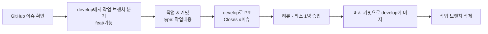

# 브랜치 · 커밋 · PR 컨벤션

Walwang 프론트엔드 협업 규칙 문서입니다. 모든 작업은 이 규칙을 따릅니다.

## 1. 브랜치 전략

### 1-1. 전체 브랜치

| 브랜치      | 용도                        |
| ----------- | --------------------------- |
| `main`      | 배포용                      |
| `develop`   | 통합 개발 브랜치            |
| `feat/`     | 기능 단위 작업 브랜치       |
| `fix/`      | 버그 수정 브랜치            |
| `hotfix/`   | 배포 후 긴급 수정 브랜치    |
| `refactor/` | 리팩토링 브랜치 (동작 동일) |
| `style/`    | CSS/레이아웃 브랜치         |
| `chore/`    | 설정 관련 브랜치            |
| `docs/`     | 문서 브랜치                 |
| `test/`     | 테스트 작업 브랜치          |

> 브랜치 접두어는 커밋 `type`과 동일하게 맞춥니다. (`feat`, `fix` …)

### 1-2. 작업 브랜치

- 형식: `<type>/<기능>`
- 예시
  - 기능: `feat/latest-design-sync`
  - 버그: `fix/alert-time-parsing`
  - 긴급: `hotfix/build-entry-path`
  - 설정: `chore/eslint-config`

✅ 작업 브랜치는 항상 `develop` 에서 딴다
✅ 머지 대상은 항상 `develop`

## ⭐️ 2. 커밋 규칙

### 2-1. 형식

```
type: 작업내용
```

- 작업내용은 한글로 작성한다.
  - 예: `style: Room 카드 레이아웃 전환`

### 2-2. type 목록

| type       | 사용하는 곳           |
| ---------- | --------------------- |
| `feat`     | 기능 추가             |
| `fix`      | 버그 수정             |
| `refactor` | 리팩토링(동작은 동일) |
| `style`    | CSS/레이아웃          |
| `docs`     | 문서                  |
| `chore`    | 설정                  |
| `test`     | 테스트                |

## ⭐️ 3. PR 규칙

### 3-1. 제목

```
<type>(작업범위): 작업내용
```

### 3-2. 본문

```
## 관련 이슈

Closes #이슈번호

## 작업 내용

-

## 스크린샷

## 필수 확인 사항

- pnpm dev
- 콘솔 에러
- 주요 페이지 진입 확인
```

### 3-3. 리뷰 규칙

| 피드백 유형     | 설명               |
| --------------- | ------------------ |
| **질문**        | 의도를 묻는 피드백 |
| **제안**        | 개선 아이디어      |
| **수정 필요**   | 반드시 수정 필요   |
| **코드 스타일** | 포맷/스타일 관련   |

### 3-4. 리뷰 승인 기준

**Approve**

- PR 설명과 실제 코드가 일치
- 콘솔 에러 / 빌드 에러 없음
- 규칙 위반 없음
- 작은 개선사항만 존재하거나 이미 반영됨

**Request changes**

- 기능이 의도대로 동작하지 않음
- 코드 구조나 로직이 불안정
- eslint/prettier/type-check 위반 있음
- 문서/이슈 연결 누락

**Comment only**

- 기능엔 문제 없지만, 개선 의견 전달

### 3-5. 머지 규칙

- `feat` → `develop` **머지 커밋(Merge commit)** 방식
  - 최소 1명 승인 → 작성자가 직접 머지하고, 작업 브랜치 삭제
  - PR 제목을 이슈 제목과 동일하게 맞춘다
- `release/*` → `main` **머지 커밋** 방식 — 배포용 릴리즈. 흐름은 [§6](#6-릴리즈-develop--main) 참고

## 4. Issue 연동 규칙

> 모든 이슈가 생성되어 있으므로, PR을 올릴 때 반드시 해당 이슈 번호로 연결한다.

✅ PR에 이슈 연결 방법 — PR 본문에 명시

```
## 관련 이슈

- Closes #17
```

## 5. 전체 흐름



## 6. 릴리즈 (develop → main)

배포 가능한 상태를 `main`에 반영할 때의 흐름. 평소 개발(§5)과 달리 **release 브랜치를 거쳐** `main`에 머지한다.

> 혼자(프론트 단독) 작업 중이라 리뷰 승인자가 없다 → **셀프 점검 후 직접 머지**한다. 대신 아래 배포 전 체크리스트를 리뷰 대용으로 반드시 돈다.

### 6-1. 흐름

```
develop  ──▶  release/vX.Y.Z  ──▶  main  (머지 후 vX.Y.Z 태그)
  (통합)       (릴리즈 고정·QA)       (배포)
```

1. `develop`에서 `release/vX.Y.Z` 브랜치를 딴다. (버전 접두어도 소문자 — 예: `release/v1.0.0`)
2. release 브랜치에서 **배포 전 체크·QA·막판 fix**(버전 bump, 문구 수정 등)만 한다. 새 기능은 넣지 않는다.
3. **release 브랜치 → `main`** 으로 PR을 연다. 본문은 릴리즈 PR 템플릿을 쓴다.
   - PR 작성 URL 끝에 `?template=release.md` 를 붙이면 선택된다. (`.github/PULL_REQUEST_TEMPLATE/release.md`)
4. 배포 전 체크리스트 통과 후 **머지 커밋**으로 `main`에 머지한다.
5. 머지된 커밋에 버전 태그를 단다.
   ```bash
   git tag v1.0.0
   git push origin v1.0.0
   ```
6. release 브랜치에서 막판 fix가 있었으면 `main`을 `develop`으로 back-merge 해 동기화한다.

### 6-2. 버전 규칙 (SemVer)

`vMAJOR.MINOR.PATCH` — 각각 호환 깨짐 / 기능 추가 / 버그 수정. `package.json`의 `version`도 함께 올린다.

- 공모전 MVP 기간엔 `minor`(기능 추가)·`patch`(버그 수정) 위주로 올린다.

> 앱스토어에 실제로 올리는 경우의 추가 점검(기본 모드 실사용 고정, 목 리뷰 정리 등)은 [demo-mode.md §9](demo-mode.md)의 배포 체크리스트를 따른다.
